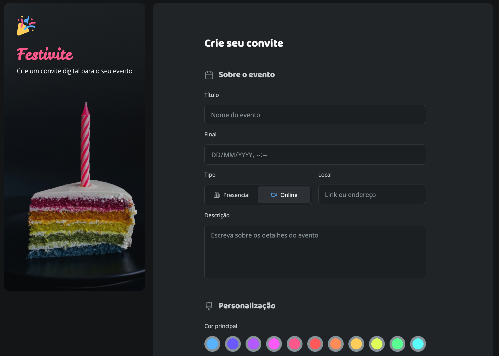
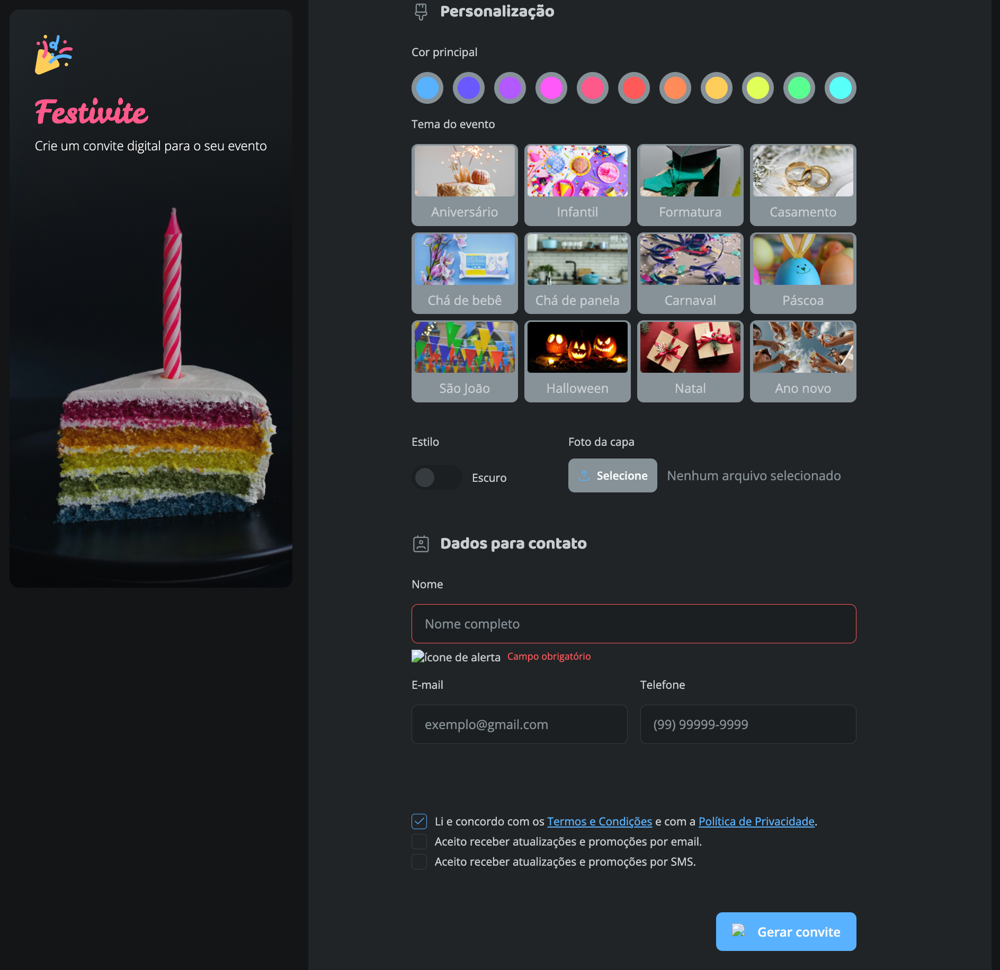

# 🚀 Desafio Festivite - Rocketseat

## 📌 Sobre

Este projeto foi desenvolvido como parte de um **desafio prático da Rocketseat**, com o objetivo de reforçar conhecimentos em HTML e CSS através da construção de uma interface temática para eventos.

Apesar de ser um exercício proposto como prática, o desafio **excedeu o conteúdo abordado nas aulas** e realmente exigiu buscar soluções fora da zona de conforto — **explorando documentações oficiais, fóruns e fazendo muitos testes práticos**.

A proposta era criar uma interface funcional e responsiva com foco em usabilidade, estilização e acessibilidade.

---

## 🎯 Desafios e Aprendizados

### ✅ O que foi tranquilo:

- Estruturação com HTML semântico
- Estilização com CSS utilizando variáveis e layout flexível

### 🚧 O que dificultou:

A parte mais desafiadora sem dúvidas foram os **inputs do tipo radio e checkbox**. Nunca imaginei que **alterar a cor de um input selecionado com uma estilização específica exigiria tanta atenção**, principalmente **sem ter prática prévia**.

Os maiores obstáculos envolveram:

- Selecionar visualmente um `input[type="radio"]` com um SVG associado
- Estilizar checkboxes com aparência customizada
- Manter acessibilidade e responsividade ao mesmo tempo

Esses pontos não haviam sido abordados diretamente nas aulas práticas, o que realmente fez deste um **desafio de verdade**. A solução foi se aprofundar na **documentação oficial do CSS**, experimentar diferentes estratégias e ajustar pequenos detalhes para que o resultado fosse fiel ao proposto.

---

## 📷 Print da Interface

---

## 🛠️ Tecnologias Utilizadas

- HTML5
- CSS3

---

## 🙌 Considerações Finais

Mesmo com dificuldades, o desafio me levou a um **novo patamar de aprendizado**, tanto técnico quanto de raciocínio para resolver problemas visuais e lógicos com CSS puro. Sem dúvida, a prática com desafios como este é o que solidifica o conhecimento. Foram dias revendo videos, estudando a aplicação, errando e refazendo até acertar ou pelo menos dentro do mínimo aceitável. Sei que faltou para realmente finalizar de acordo com o projeto proposto, mas consegui construir um pequeno degrau nessa enorme escadaria.

---

### 🚀 Desenvolvido com 💜 por Archtech - Projeto de direitos autorais pela Rocketseat, uso totalmente para aprendizagem.
